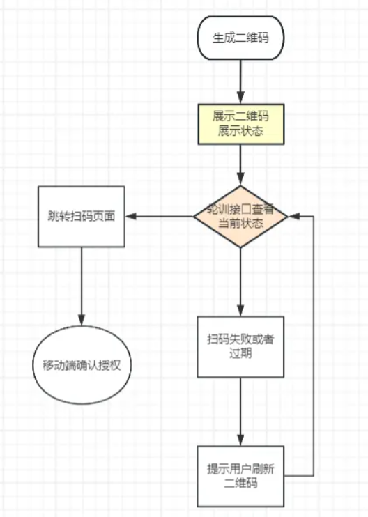

## Single Sing-On

sso单点登录：在一个公司下，用户只需要登录其中一个应用，就可以登录公司下其他的所有应用

每个应用登录页面都使用同一个登录页面

应用刚一进就访问登录接口，跳转到登录页面，如果有token就不访问，登录时拼接上appId用于登录成功后跳转回当前应用

后端登录成功后种一个cookie，过期时间等，存一个信息用于区别已经登录，如果已经登录过，别的应用访问直接免登录

## Single Device Login

单设备登录：同一个账号在同一个设备上登录，其他设备上会挤掉当前设备

使用ws实现，初始化一个对象，当一次登录使用用户的id当key，如果key存在，则挤掉当前设备

## Scan Code Login

扫码登录

qrcode.js生成二维码

jsonwebtoken生成token

